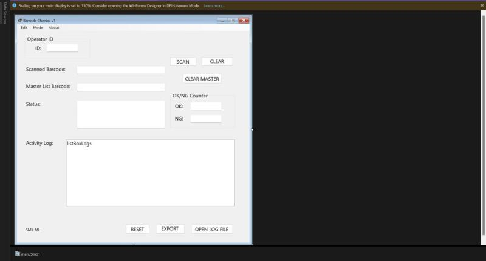

# BarcodeMatch - Barcode Comparer Software 🖥️

BarcodeMatch is a Windows Forms application designed to compare barcodes against a master list. It provides functionality for scanning barcodes, logging results, exporting logs to Excel, and managing user roles (Engineer and Operator). The application is built using .NET 8.0 and leverages libraries such as EPPlus and ExcelDataReader for Excel file handling.



---
## Table of Contents
- [Features](#features)
- [Project Components](#project-components)
- [Dependencies](#dependencies)
- [Installation](#installation)
- [Usage](#usage)
- [Future Enchancements](#future-enhancements)
- [Contributions](#contributions)
- [Acknowledgments](#acknowledgments)
- [License](#license)

---

## Features

- **Barcode Scanning**: Supports barcode scanning using a USB barcode scanner.
- **Master List Management**: Load and clear master list barcodes.
- **Activity Logging**: Logs barcode scanning results (OK/NG) with timestamps.
- **Export Logs**: Export activity logs to an Excel file.
- **User Roles**: Engineer and Operator roles with different permissions.
- **Operator ID Management**: Requires Operator ID input before starting.
- **Product Number Registration**: Allows engineers to register product numbers.
- **Keyboard Shortcuts**: Supports Enter and Escape keys for quick actions.

---

## Project Components

### Main Forms

1. **Form1**: The main interface for barcode scanning and log management.
   - File: [Form1.cs](WinFormsApp1/Form1.cs)
   - Designer: [Form1.Designer.cs](WinFormsApp1/Form1.Designer.cs)
   - Resources: [Form1.resx](WinFormsApp1/Form1.resx)

2. **Form2**: Used for registering product numbers.
   - File: [Form2.cs](WinFormsApp1/Form2.cs)
   - Designer: [Form2.Designer.cs](WinFormsApp1/Form2.Designer.cs)
   - Resources: [Form2.resx](WinFormsApp1/Form2.resx)

3. **LoginForm**: Handles user authentication for Engineer mode.
   - File: [LoginForm.cs](WinFormsApp1/LoginForm.cs)
   - Resources: [LoginForm.resx](WinFormsApp1/LoginForm.resx)

4. **OperatorID**: Captures the Operator ID at the start of the session.
   - File: [OperatorID.cs](WinFormsApp1/OperatorID.cs)
   - Designer: [OperatorID.Designer.cs](WinFormsApp1/OperatorID.Designer.cs)
   - Resources: [OperatorID.resx](WinFormsApp1/OperatorID.resx)

### Supporting Files

- **Program.cs**: Entry point for the application. ([Program.cs](WinFormsApp1/Program.cs))
- **UserRole.cs**: Enum defining user roles (Engineer, Operator). ([UserRole.cs](WinFormsApp1/UserRole.cs))
- **Resources**: Contains application resources. ([Resources.Designer.cs](WinFormsApp1/Properties/Resources.Designer.cs), [Resources.resx](WinFormsApp1/Properties/Resources.resx))

---

## Dependencies

The project uses the following NuGet packages:

- **EPPlus**: For creating and exporting Excel files.
- **ExcelDataReader**: For reading Excel files.
- **USB-Barcode-Scanner**: For handling barcode scanner input.

---

## Installation

1. Clone the repository:
   ```bash
   git clone <repository-url>
   ```
2. Open the solution file `WinFormsApp1.sln` in Visual Studio.
3. Restore NuGet packages:
   ```bash
   dotnet restore
   ```
4. Build and run the project:
   ```bash
   dotnet build
   dotnet run
   ```

---

## Usage

### Starting the Application

1. Launch the application.
2. Enter the Operator ID in the **OperatorID** form.
3. Proceed to the main interface.

### Barcode Scanning

1. Scan a barcode using a USB barcode scanner.
2. The application compares the scanned barcode with the master list.
3. Results are logged as **OK** (match) or **NG** (no match).

### Exporting Logs

1. Click the **Export Log** button.
2. Save the log as an Excel file.

### User Roles

- **Engineer**: Access to advanced features like product number registration and log export.
- **Operator**: Limited access to basic scanning functionality.

---

## Keyboard Shortcuts

- **Enter**: Trigger the primary action (e.g., scan barcode, save configuration).
- **Escape**: Cancel or close the current form.

---

## Future Enhancements

Here are some possible improvements and features:

1. **Cloud Integration**: 
   - Enable synchronization of master barcode lists and logs with cloud storage (e.g., Google Drive, OneDrive).
   - Allow multi-device access to shared data.

2. **Advanced Reporting**:
   - Add detailed analytics and reporting features for barcode scanning trends and performance.

3. **Customizable Roles**:
   - Allow administrators to define custom user roles with specific permissions.

4. **Real-Time Notifications**:
   - Notify users of mismatched barcodes or errors via email or SMS.

5. **Integration with External Systems**:
   - Provide APIs for integration with inventory management or ERP systems.

6. **Barcode Format Support**:
    - Expand support for additional barcode formats (e.g., QR codes, Data Matrix).

---

## Contributions

1. Fork the repository.
2. Create a feature branch:
   ```bash
   git checkout -b feature-name
   ```
3. Commit your changes:
   ```bash
   git commit -m "Add feature description"
   ```
4. Push to the branch:
   ```bash
   git push origin feature-name
   ```
5. Open a pull request.

---

## License

This project is licensed under the MIT License. See the [LICENSE](LICENSE) file for details.

---

## Acknowledgments

- Designed by Fakhrul Fauzi.
- Built using .NET 8.0 and Windows Forms.
